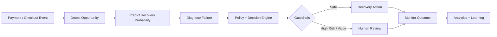

# RecoverAI — AI Revenue Recovery OS

[](https://github.com/aryanshah012/RecoverAI/actions/workflows/ci.yml)

RecoverAI is an **AI-powered revenue recovery platform** for merchants. It detects revenue at risk across failed payments, abandoned checkouts, and unsuccessful subscription renewals, predicts recoverability, recommends bounded actions, applies deterministic safety policies, and measures recovered revenue.

> **Demo scope:** synthetic datasets and Razorpay Test/Mock mode. Simulation results are not presented as real merchant performance.

## 🔁 Core Pipeline

**Detect → Predict → Diagnose → Decide → Safely Act → Monitor → Recover → Learn**

## ✨ Key Features

- Detects failed payments, abandoned checkouts, and subscription failures
- Predicts recovery probability using a reproducible ML pipeline
- Ranks opportunities by expected recovery value
- Recommends best recovery action and timing
- Supports safe actions such as payment links, retries, and merchant-approved incentives
- Uses deterministic retry limits, duplicate checks, budget controls, and idempotency
- Requires human review for high-value or risky cases
- Verifies Razorpay webhook signatures in Test Mode
- Tracks revenue at risk, recovered revenue, and recovery performance
- Includes merchant Copilot over verified analytics
- Maintains an auditable recovery decision trail

## 🧠 System Architecture



## 🛡️ Safety by Design

- The LLM never directly controls payment movement.
- Refunds, payouts, transfers, arbitrary SQL, and shell execution are not exposed as Copilot tools.
- Retry limits and duplicate-recovery checks are deterministic.
- Incentives must come from merchant-approved policy records.
- High-value cases require human approval.
- Webhook ingestion is signature-verified and idempotent.

## 🛠️ Tech Stack

| Layer | Technology |
|---|---|
| Backend | Python, FastAPI |
| ML | scikit-learn / Python ML pipeline |
| Frontend | Next.js / React |
| Data | PostgreSQL, Redis |
| Payments | Razorpay Test / Mock Mode |
| Infra | Docker, Alembic |
| Testing | Pytest |

## 🚀 Quick Start

```bash
cp .env.example backend/.env
docker compose up -d postgres redis

cd backend
python -m venv .venv
source .venv/bin/activate
pip install -r requirements.lock
alembic upgrade head
python scripts/seed_demo.py
uvicorn app.main:app --reload
```

In another terminal:

```bash
cd frontend
npm install
cp .env.example .env.local
npm run dev
```

Frontend: `http://localhost:3000`  
Backend: `http://localhost:8000`  
Swagger: `http://localhost:8000/docs`

## 🤖 Train the Recovery Model

```bash
python ml/generate_recovery_data.py
python ml/train_recovery_model.py
python ml/evaluate_recovery_model.py
```

## 🧪 Tests

```bash
cd backend
pytest -q
```

## 📚 Documentation

- `docs/architecture.md` — system design
- `docs/safety.md` — guardrails and safety model
- `docs/evaluation.md` — evaluation approach

## 🎯 Why RecoverAI

Most recovery systems treat every failure similarly. RecoverAI combines **prediction, prioritization, policy, safe action, and measurement** in one workflow so merchants can focus recovery effort where it has the highest expected value while reducing customer friction.

---
Built as a practical AI/ML + fintech project focused on **safe automation, measurable outcomes, and production-style engineering**.

## Engineering Standards

- Automated CI validates changes on pushes and pull requests.
- Dependabot monitors Python and/or JavaScript dependencies where applicable.
- [CONTRIBUTING.md](CONTRIBUTING.md) documents the development workflow and review expectations.
- [SECURITY.md](SECURITY.md) documents responsible vulnerability reporting and security principles.
